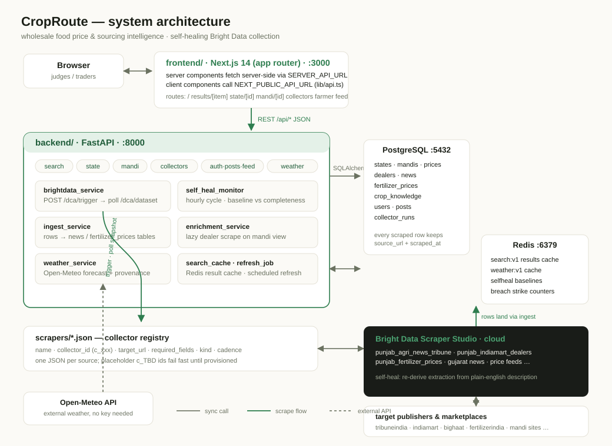

<p align="center">
  
</p>

<h3 align="center">Wholesale food price &amp; sourcing intelligence for India</h3>

<p align="center">
  Search a commodity — get states &amp; mandis ranked by price and supply, dealer contacts,
  weather, agri news and fertilizer costs per region. Farmers post live price updates from
  the ground; everything sourced through <b>self-healing Bright Data collectors</b>.
</p>

<p align="center">
  
  
  
  
  
  
  
</p>

---

| | |
|---|---|
|  |  |


## The problem

A wholesaler buying wheat doesn't know which state or mandi is cheapest *today*, whom to
call there, what the weather is doing to supply, or what the trade press is saying. Govt
portals publish mandi prices but they are slow, inconsistent, and die silently — and when
a source breaks, nobody notices until the numbers stop making sense.

## The solution

CropRoute answers all of it in one search — and every number carries its source:

- **Search any commodity** → states &amp; mandis ranked by price and arrivals, with 7-day
  trend sparklines per market.
- **Region pages** per state → top mandis, live weather, agri news (with video),
  fertilizer prices and crop-knowledge cards — each section independently status'd so one
  dead source never blanks the page.
- **Self-healing collection** — Bright Data Scraper Studio collectors are re-run hourly by
  a monitor that scores field completeness against a rolling baseline, detects breakage,
  re-derives the extraction, and verifies the heal.
- **Farmer ground-truth** — farmers log in and post live mandi prices; those posts merge
  into the same feed as scraped news.
- **Provenance everywhere** — every scraped value stores `source_url` + `scraped_at` and
  renders with a provenance chip. Unattributed data looks fabricated; ours never is.

The core of the project is scraping: mandi networks, dealer marketplaces, agri news and
fertilizer retailers are collected via Bright Data, watched by the self-heal monitor, and
persisted by an ingest layer into domain tables.

## System architecture



- **frontend/** — Next.js 14 app router. Server components fetch server-side
  (`SERVER_API_URL`), interactive pieces call the API directly; all access goes through
  `lib/api.ts`.
- **backend/** — FastAPI. One router per resource; third-party calls isolated in
  `services/`. The region bundle (`GET /api/state/:id`) resolves five sections
  concurrently in a thread pool.
- **scrapers/*.json** — one config per collector: registry name, Bright Data collector id,
  target URL, required fields, ingest `kind`, cadence.
- **datastores** — Postgres keeps domain tables (prices, dealers, news, fertilizer prices,
  crop knowledge, posts, collector runs); Redis holds the search/weather caches plus the
  self-heal baselines and strike counters.

### Bright Data features used

| Feature | Purpose |
|---|---|
| **Scraper Studio collectors** | One collector per source; plain-English extraction schema |
| **Trigger API** (`POST /dca/trigger`) | Queue a collection run per collector |
| **Snapshot polling** (`GET /dca/dataset`) | Await rows; empty array = legitimate result |
| **Re-derive on breakage** | Self-heal asks Studio to re-extract from the description |
| **Per-source configs in repo** | `scrapers/*.json` registry with required fields for scoring |

## Quick start

### Prerequisites

| Requirement | Minimum | Notes |
|---|---|---|
| Docker + compose v2 | recent stable | must be running before `up` |
| Free ports | 3000, 8000, 5432, 6379 | stop conflicting services first |
| Disk | ~3 GB | images + node_modules volume |
| Bright Data account | optional for demo | only needed for *live* scraping |

### 1. Configure

```bash
cp infra/.env.example infra/.env
```

Edit `infra/.env`: set `BRIGHTDATA_API_KEY` (Account Settings → API Tokens on
brightdata.com) and any long random string for `JWT_SECRET`. Everything else works
pre-filled for compose networking.

### 2. Boot the stack

```bash
docker compose -f infra/docker-compose.yml up
```

First boot installs deps inside the containers (a few minutes). When it settles:

| Service | URL |
|---|---|
| Frontend | http://localhost:3000 |
| Backend API | http://localhost:8000 |
| OpenAPI docs | http://localhost:8000/docs |
| PostgreSQL | localhost:5432 |
| Redis | localhost:6379 |

### 3. Seed demo market data

```bash
docker compose -f infra/docker-compose.yml exec backend python -m db.seed_market_data
```

Idempotent — safe to re-run. Adds Punjab/Gujarat mandis with wheat, rice, cotton and
groundnut price series, real linked agri-news (including an embedded video), fertilizer
price blocks and crop-knowledge cards. Base states/commodities seed automatically on
first backend boot.

### 4. Verify

```bash
curl -s http://localhost:8000/api/health          # {"status":"ok"}
curl -s "http://localhost:8000/api/search?item=wheat"
```

Open http://localhost:3000 and search `wheat`.

## Usage

All examples hit the running stack from another terminal.

```bash
# Ranked mandis for a commodity (cheapest first, trend % vs own baseline)
curl -s "http://localhost:8000/api/search?item=cotton"

# Region bundle for Punjab (id 21): top mandis + weather + news + fertilizer + knowledge
curl -s http://localhost:8000/api/state/21

# Self-heal panel data, then force-run one collector (heal included)
curl -s http://localhost:8000/api/collectors/status
curl -s -X POST http://localhost:8000/api/collectors/trigger \
     -H 'Content-Type: application/json' -d '{"collector":"punjab_agri_news_tribune","heal":true}'

# Farmer flow: login -> post a live price -> see it in the feed
TOKEN=$(curl -s -X POST http://localhost:8000/api/auth/login \
  -H 'Content-Type: application/json' -d '{"name":"ravi","role":"farmer"}' | jq -r .token)
curl -s -X POST http://localhost:8000/api/posts \
  -H "Authorization: Bearer $TOKEN" -H 'Content-Type: application/json' \
  -d '{"commodity_id":2,"mandi_id":5,"price":2380,"note":"arrivals heavy today"}'
curl -s http://localhost:8000/api/feed
```

In the UI: search from `/`, drill into a state page, watch `/collectors`, post from
`/farmer`, read the merged stream at `/feed`.

## Demo narrative (for judges)

**Scene:** a wholesaler sources wheat; a source breaks mid-demo; the system heals itself.

| Step | Action | What happens |
|------|--------|--------------|
| 1 | **Search** | `wheat` returns Punjab/Haryana mandis ranked cheapest-first with sparklines |
| 2 | **Drill down** | State page renders five sections concurrently; each carries its own status chip |
| 3 | **Trust check** | Every card shows publisher + last-verified via provenance chips |
| 4 | **Break** | From `/collectors`, force-break a healthy collector — its required fields go blank like a site redesign |
| 5 | **Detect** | Monitor scores completeness against the Redis baseline and flags `broken` with field-level evidence |
| 6 | **Heal** | Re-derive runs, verification pass meets baseline → `self_healed`; full transition history stays queryable |
| 7 | **Ground truth** | Farmer logs in and posts today's price; it merges into `/feed` beside scraped news |
| 8 | **Resilience proof** | Kill any upstream mid-page-load — the bundle still returns 200 with that section marked `failed` |

## Key features → where they live

| Feature | File(s) |
|---|---|
| Collector trigger/poll transport with retry semantics | `backend/services/brightdata_service.py` |
| Self-heal state machine (`healthy→broken→self_healed/failed`) | `backend/services/self_heal_monitor.py` |
| Row persistence (news upsert-by-URL, fertilizer snapshots) | `backend/services/ingest_service.py` |
| Lazy dealer enrichment on mandi views | `backend/services/enrichment_service.py` |
| Concurrent region bundle with per-section degradation | `backend/routers/state.py` |
| Server/client-safe API access with runtime base-URL split | `frontend/lib/api.ts` |
| Provenance rendering (source + last-verified) | `frontend/components/ProvenanceChip.tsx` |
| Farmer posts merged into scraped feed | `backend/routers/{posts,feed}.py` |

## Testing

```bash
# Backend suite (weather service contract + degradation)
docker compose -f infra/docker-compose.yml exec backend python -m pytest tests/ -v

# Frontend lint
cd frontend && npm run lint
```

## Environment variables (`infra/.env`)

| Variable | Required | Default | Description |
|---|---|---|---|
| `BRIGHTDATA_API_KEY` | for live scraping | — | Bright Data API token |
| `JWT_SECRET` | yes | — | signs farmer session tokens |
| `DATABASE_URL` / `REDIS_URL` | no | pre-filled | compose service hostnames |
| `NEXT_PUBLIC_API_URL` | no | `http://localhost:8000` | browser-side API base |
| `SERVER_API_URL` | no | `http://backend:8000` | SSR-side API base (compose network) |
| `DATA_GOV_API_KEY` | no | — | legacy refresh job only |
| `REFRESH_INTERVAL_HOURS` | no | `1` | scheduled refresh cadence |

## Layout

```
├── frontend/    Next.js + TypeScript + Tailwind (search, map, self-heal panel)
├── backend/     FastAPI: main.py, routers/, services/, models/, db/
├── scrapers/    Bright Data collector configs, one JSON per source
├── mcp/         optional MCP tool wrapper (stretch)
├── infra/       docker-compose.yml + .env.example
└── docs/        product, architecture, design system, contracts, backlog
```

## Documentation

Start at [CLAUDE.md](CLAUDE.md) if you are an agent,
[docs/PRODUCT.md](docs/PRODUCT.md) if you are a human.

| Doc | Covers |
|---|---|
| [docs/PRODUCT.md](docs/PRODUCT.md) | Users, jobs, non-goals, glossary of Indian agri terms |
| [docs/ARCHITECTURE.md](docs/ARCHITECTURE.md) | Services, endpoints, DB schema |
| [docs/PAGES.md](docs/PAGES.md) | Route map, per-element data sources |
| [docs/UI-DESIGN.md](docs/UI-DESIGN.md) | Tokens, components, states, map palette, motion |
| [docs/API.md](docs/API.md) | Request/response contracts |
| [docs/DATA-SOURCES.md](docs/DATA-SOURCES.md) | Every upstream, auth, cadence, legality |
| [docs/SELF-HEAL.md](docs/SELF-HEAL.md) | Collector state machine and the demo break/heal |
<!-- | [docs/BACKLOG.md](docs/BACKLOG.md) | Issues 1–40 with status | -->
| [docs/DEMO.md](docs/DEMO.md) | Demo runbook |
| [scrapers/README.md](scrapers/README.md) | Collector registry |
